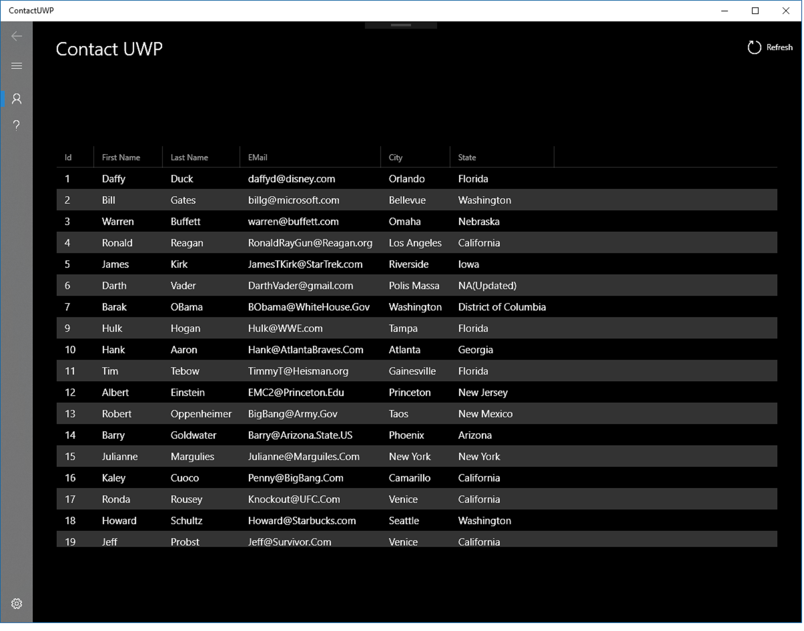

ContactUWP
===

A simple Universal Windows Program (UWP) to display a customer list using a NavigationView and a DataGrid

For more informaton:
* [NavigationView](https://docs.microsoft.com/en-us/windows/uwp/design/controls-and-patterns/navigationview)
* [DataGrid](https://github.com/Microsoft/WindowsCommunityToolkit)

To Do:
* Add / Delete Contact
* Contact Detail
* Sort Contacts
* Search Contacts
* Contact Settings

